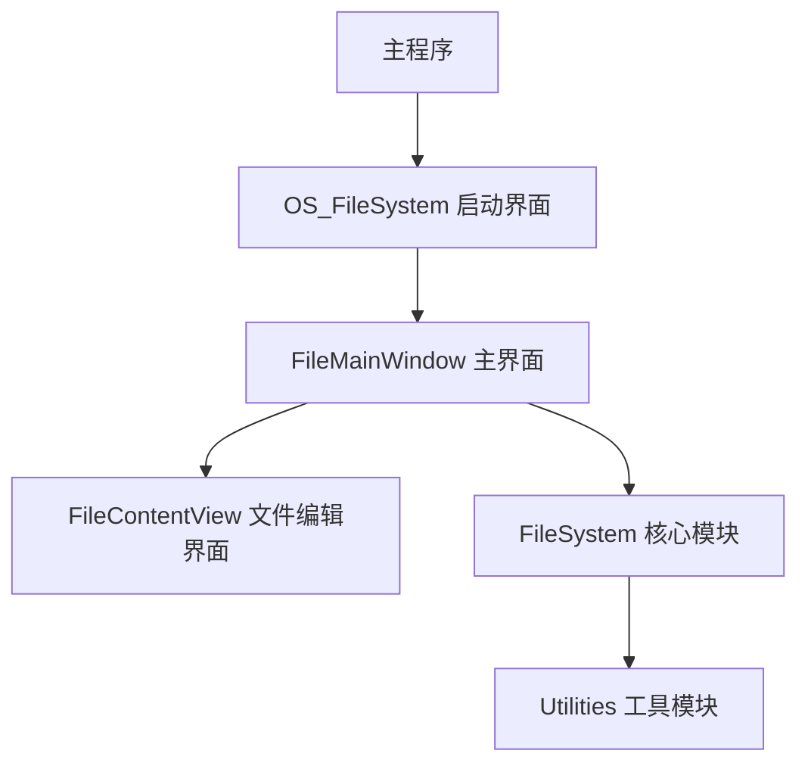
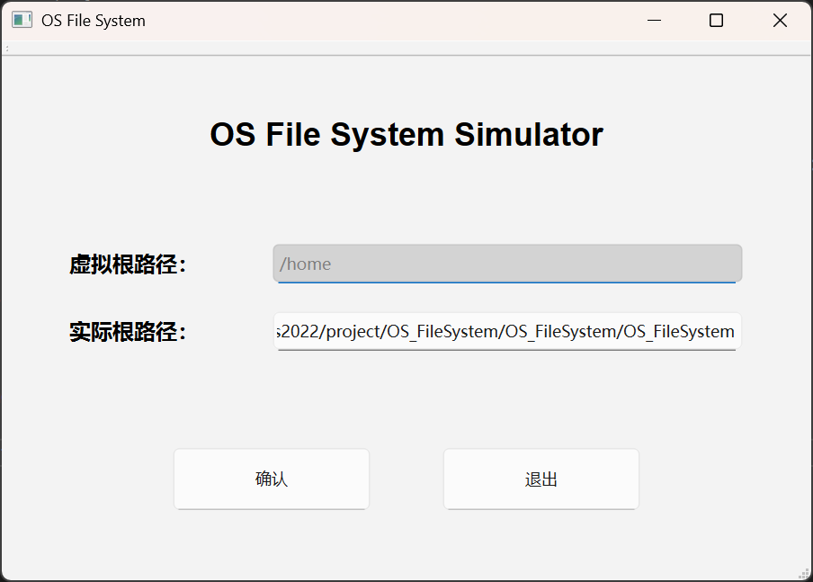
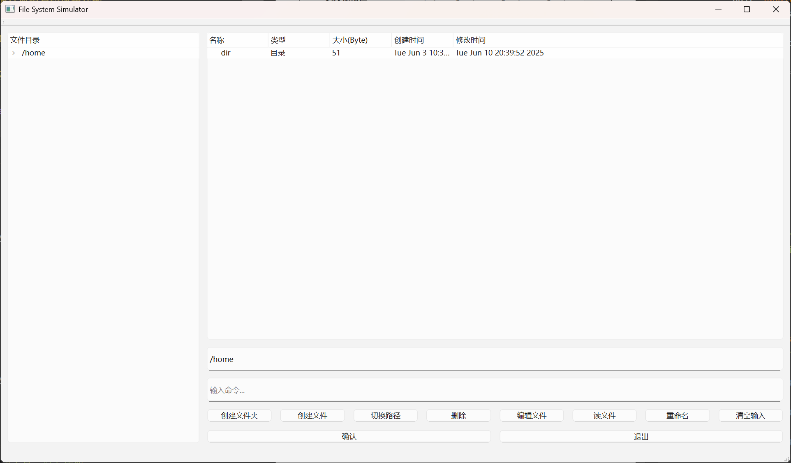
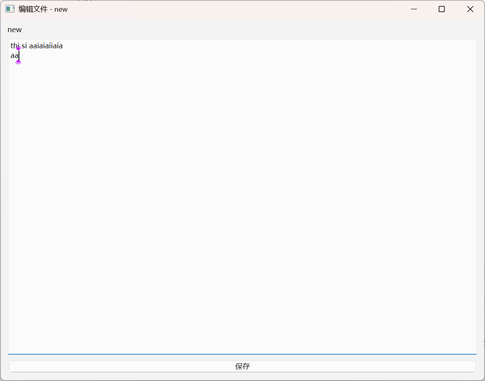

## 一、项目概述
### 1.1 项目背景

在操作系统课程中，文件系统作为核心模块，负责管理计算机的存储资源和文件组织。本项目旨在实现一个简化的文件系统，通过实践深入理解文件系统的内部机制，包括存储空间管理、目录结构设计和文件操作实现。

### 1.2 项目目标

1.  实现基于 FAT（文件分配表）的存储空间管理

2.  使用位图算法管理空闲存储块

3.  设计多级目录结构和索引节点（Inode）系统

4.  实现完整的文件操作功能集

5.  提供图形用户界面便于交互

### 1.3 开发环境
*   开发语言：C++
*   图形框架：Qt 6.4.0

## 二、数据结构设计

```cpp
// 配置信息
struct Config {
   QString rootPath;       // 虚拟根路径
   QString realRootPath;   // 物理根路径
   QString currentPath;    // 当前工作路径
};

// 文件类型枚举
enum class FileType {
    File,       // 普通文件
    Directory   // 目录
};

// 索引节点结构
struct Inode {
   int firstBlock;         // 首个数据块号
   qint64 size;            // 文件大小(字节)
   QDateTime createTime;   // 创建时间
   QDateTime modifyTime;   // 修改时间
};

// 文件/目录项基础结构
struct FileItem {
    std::string name;          // 名称（不含路径）
    FileType type;             // 类型（文件/目录）
    qint64 size;               // 大小（字节，目录为0）
    QDateTime createTime;      // 创建时间
    QDateTime modifyTime;      // 修改时间
    int inode;                 // 索引节点号
};

// 目录结构体（包含子项列表）
struct Directory {
    std::string path;          // 目录路径（全路径，如"/docs"）
    std::vector<FileItem> items; // 子文件/目录列表
};

// 文件分配表
using FAT = std::vector<int>;         // 块号映射表，-1表示结束
const int BLOCK_COUNT = 1024;      // 总块数

// 位图结构
using Bitmap = std::bitset<BLOCK_COUNT>;
```

## 三、项目架构与实现的功能
### 3.1 项目架构
项目采用模块化设计，主要分为以下几个部分：
- **主程序**：负责启动和初始化
- **OS_FileSystem**：图形界面模块，提供用户交互
- **FileMainWindow**：主界面，显示文件系统信息
- **FileContentView**：文件编辑界面，支持文件内容查看和编辑
- **FileSystem**：核心模块，处理文件系统逻辑
- **Utilities**：工具模块，提供辅助功能，如日志记录、错误处理等



### 3.2 功能模块实现

#### 文件系统初始化

- 启动时检查并加载 FAT 表和位图
- 创建 inode 存储目录

**示例代码（main.cpp）：**

```cpp
void loadFileSystem() {
    if (!QFile::exists("fat.bin") || !QFile::exists("bitmap.bin")) {
        fat.assign(BLOCK_COUNT, -1);
        bitmap.reset();
        formatFileSystem();
    }
}
```

---

#### 目录管理

- 多级目录结构支持
- 递归计算目录大小

**示例代码（FileSystem.cpp）：**

```cpp
Directory getDirectoryInfo(const std::string& path) {
    Directory dirInfo;
    QDir dir(QString::fromStdString(getFullPath(path)));
    // 递归处理子目录
    for (const auto& fileInfo : dir.entryInfoList()) {
        if (fileInfo.isDir()) {
            // 递归计算目录大小
            QDir subDir(fileInfo.absoluteFilePath());
            qint64 totalSize = 0;
            for (const auto& subFileInfo : subDir.entryInfoList()) {
                totalSize += subFileInfo.size();
            }
            item.size = totalSize;
        }
    }
    return dirInfo;
}
```

---

#### 文件操作

- 创建/删除文件（touch/rm）
- 读写文件内容（read/write）
- 文件重命名（rename）

**示例代码（FileMainWindow.cpp）：**

```cpp
void FileMainWindow::handleCommand(const std::string& command) {
    if (tokens[0] == "touch") {
        // 创建文件逻辑
    } else if (tokens[0] == "rm") {
        // 删除文件逻辑
    } else if (tokens[0] == "read") {
        // 读取文件内容
    } else if (tokens[0] == "write") {
        // 写入文件内容
    }
}
```

---

#### 存储管理

- FAT 表管理文件块分配
- 位图跟踪空闲块

**示例代码（Utilities.cpp）：**

```cpp
int allocateBlock() {
    for (int i = 0; i < BLOCK_COUNT; ++i) {
        if (!bitmap.test(i)) {
            return i; // 返回空闲块号
        }
    }
    return -1; // 无空闲块
}
```

---

#### GUI 界面

- 目录树形展示
- 文件列表详细视图
- 命令输入与快捷操作

**示例代码（FileMainWindow.cpp）：**

```cpp
void FileMainWindow::InitWidget() {
    // 左侧目录树
    QTreeWidget* directoryTree = new QTreeWidget();
    // 右侧文件列表
    QTreeWidget* fileList = new QTreeWidget();
    // 命令输入框
    commandInput = new QLineEdit();
    // 快捷按钮
    QPushButton* mkdirButton = new QPushButton("创建文件夹");
}
```

## 四、效果展示
### 4.1 启动界面


* 设置虚拟根路径和实际物理路径
* 路径合法性验证
* 自动创建不存在的目录

### 4.2 主操作界面


* 左侧：目录树形结构展示
* 右上：当前路径显示
* 右中：文件列表（名称、类型、大小、时间）
* 右下：命令输入区和快捷按钮

### 4.3 文件编辑界面


* 文件名标题显示
* 文本编辑区域
* 保存按钮（可编辑模式）
* 只读模式不显示保存按钮

## 五、核心算法实现

### 5.1 路径解析算法

* 解析相对路径和绝对路径，返回完整路径

```cpp
std::string getFullPath(const std::string& relativePath) {
    if (relativePath[0] == '/') {
        return config.realRootPath + relativePath;
    } else {
        return config.realRootPath + config.currentPath + "/" + relativePath;
    }
}
```

### 5.2 FAT 分配算法

* 创建文件时，分配空闲块并更新 FAT 表和位图，并初始化 inode
* 如果分配失败，返回错误信息
* 创建文件时，更新 inode 信息

```cpp
bool createFile(const std::string& path) {
    int block = allocateBlock(); // 获取空闲块
    if (block != -1) {
        bitmap.set(block); // 标记为已使用
        fat[block] = -1; // 设置FAT表项

        // 创建inode
        Inode inode;
        inode.firstBlock = block;
        inode.size = 0;
        saveInode(path, inode);
        return true;
    }
    return false;
}
```

### 5.3 目录切换算法

* 处理 cd 命令，支持相对路径和绝对路径
* 更新当前路径并刷新目录视图
* 处理特殊路径符号（如 `..` 和 `~`），返回上级目录或根目录

```cpp
void FileMainWindow::handleCommand(const std::string& command) {
    if (tokens[0] == "cd") {
        if (tokens[1] == "..") {
            // 返回上级目录
            size_t pos = config.currentPath.rfind('/');
            config.currentPath = config.currentPath.substr(0, pos);
        } else if (tokens[1] == "~") {
            // 返回根目录
            config.currentPath = "/home";
        } else {
            // 拼接新路径
            config.currentPath = config.currentPath + "/" + tokens[1];
        }
        updateDirectoryView();
    }
}
```

### 5.4 文件内容读写

* 读取文件内容时，加载对应 inode 的数据块
* 写入文件时，更新 inode 的大小和修改时间

```cpp
std::string readFileContent(const std::string& path) {
    QFile file(QString::fromStdString(getFullPath(path)));
    if (file.open(QIODevice::ReadOnly)) {
        QTextStream in(&file);
        return in.readAll().toStdString();
    }
    return "";
}

bool writeFileContent(const std::string& path, const std::string& content) {
    QFile file(QString::fromStdString(getFullPath(path)));
    if (file.open(QIODevice::WriteOnly)) {
        QTextStream out(&file);
        out << QString::fromStdString(content);

        // 更新inode信息
        Inode inode = loadInode(path);
        inode.size = content.size();
        saveInode(path, inode);
        return true;
    }
    return false;
}
```

---

## 六、核心算法时间复杂度分析

| 算法            | 时间复杂度 | 空间复杂度 | 说明                 |
| --------------- | ---------- | ---------- | -------------------- |
| 路径解析        | O(1)       | O(1)       | 简单字符串拼接       |
| 空闲块分配      | O(n)       | O(1)       | n=1024（块总数）     |
| 目录遍历        | O(m)       | O(k)       | m=文件数，k=目录深度 |
| 文件内容读取    | O(s)       | O(s)       | s=文件大小           |
| FAT 链式查找    | O(l)       | O(1)       | l=文件占用块数       |
| 目录切换        | O(1)       | O(1)       | 路径字符串操作       |

